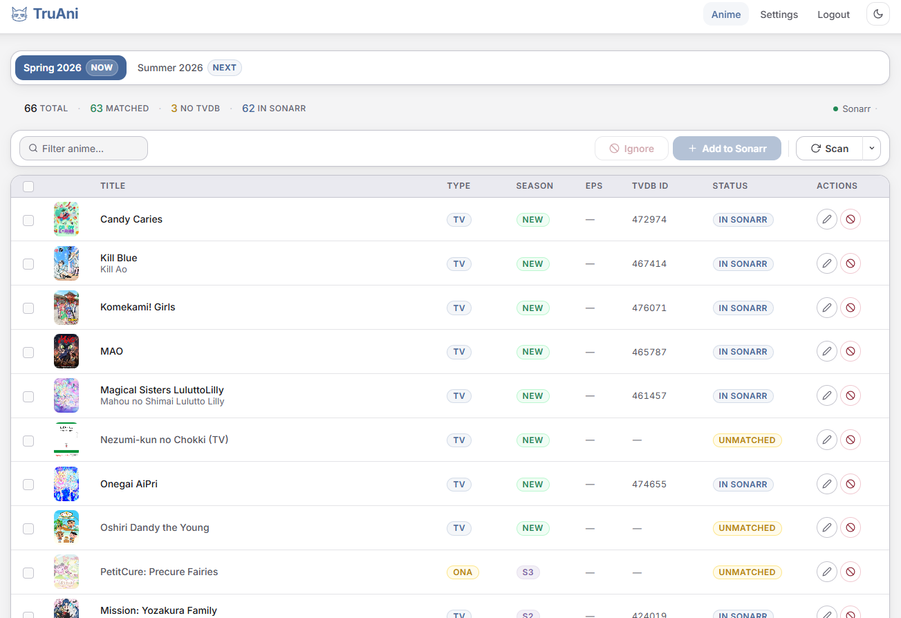
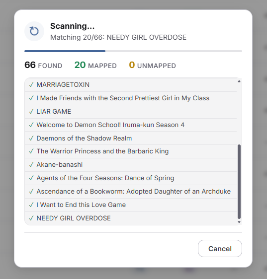
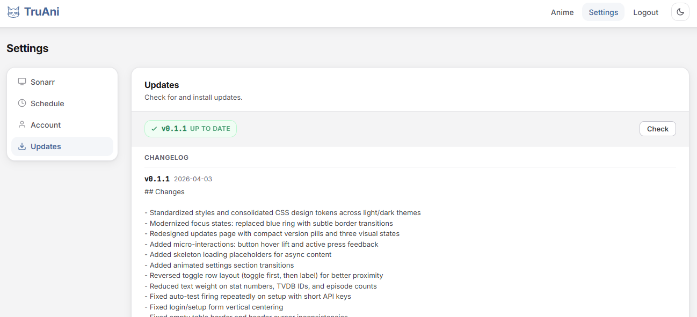

<p align="center">
  
</p>

<h1 align="center">TruAni</h1>
<p align="center">Seasonal Anime Manager for Sonarr</p>

---

TruAni keeps your Sonarr library up to date with each anime season. It pulls the latest seasonal anime from AniList, matches them to TVDB, and lets you import them into Sonarr with a single click. No more manually searching for new shows every season.

> **Note:** This is a personal project, built primarily as a learning experience. I run it on my own network and will fix issues as they come up, but I make no commitments to adding new features, functionality, or services. If it's useful to you too, great!

## Screenshots

<p align="center">
  <br>
  <em>Dashboard — browse and manage seasonal anime</em>
</p>

<p align="center">
  <br>
  <em>Scanning — real-time progress as anime are discovered and matched</em>
</p>

<p align="center">
  <br>
  <em>Updates — check for and install updates from within the app</em>
</p>

## Features

- **Automatic discovery** — Fetches current and upcoming anime seasons from AniList, filtered by format and popularity
- **Smart matching** — Resolves TVDB IDs through Sonarr's lookup API with intelligent title matching across English, romaji, and synonym titles
- **One-click imports** — Select the shows you want and push them straight to Sonarr with your preferred quality profile, root folder, and tags
- **Manual overrides** — If a title doesn't auto-match, you can set the TVDB ID yourself
- **Scheduled refreshes** — Runs in the background on your schedule (every 6h, 12h, daily, or weekly)
- **Ignore list** — Hide titles you don't want cluttering your dashboard
- **In-app updates** — Update to the latest version directly from the settings page
- **Light and dark themes** — Follows your system preference or toggle manually

## Getting Started

TruAni runs anywhere — pick whichever method fits your setup.

### Proxmox LXC (recommended for Proxmox users)

Run this on your Proxmox host and follow the prompts:

```
bash -c "$(curl -fsSL https://raw.githubusercontent.com/Rozzly/TruAni/main/scripts/install-lxc.sh)"
```

This creates a Debian 13 container, installs everything, and starts the service. You'll be prompted for container settings with sensible defaults.

### Any Debian/Ubuntu system

Run inside an existing VM, container, or bare metal server:

```
bash -c "$(curl -fsSL https://raw.githubusercontent.com/Rozzly/TruAni/main/scripts/install.sh)"
```

### Docker

```
git clone https://github.com/Rozzly/TruAni.git
cd TruAni
cp .env.example .env
docker compose up -d
```

### First login

Open `http://<your-host>:5656` in your browser. The default credentials are `truani` / `truani` — you'll be asked to change these immediately. After that, connect your Sonarr instance and you're ready to go.

## Updating

TruAni checks for updates weekly. When a new version is available, a banner appears on the dashboard.

**From the web UI:** Go to Settings > Updates and click "Update Now". The app pulls the latest code, installs any new dependencies, and restarts itself. That's it.

**From the command line (LXC):**

```
pct exec <CTID> -- update
```

**Docker:**

```
git pull origin main
docker compose up --build -d
```

## How it works

Each scan pulls the current anime season from AniList, then attempts to match every title to a TVDB ID using Sonarr's search API. It tries English titles, romaji titles, and known synonyms, strips season suffixes for broader matches, and validates results by genre and year. Anything it can't match automatically gets flagged so you can resolve it manually.

When you import, TruAni pushes each matched series to Sonarr with your configured settings. Series already in Sonarr are detected and skipped.

All data is stored in a single SQLite database. Everything can be re-fetched from AniList and Sonarr at any time, so there's nothing critical to back up.

## Security

TruAni is built for home networks, not the public internet.

- All pages require login (session-based with bcrypt password hashing)
- Login rate limiting with automatic lockout after failed attempts
- Default credentials must be changed on first login
- Runs as a non-root user inside the container

## Requirements

- A running Sonarr instance (v3 or v4)
- Docker, a Debian/Ubuntu system, or Proxmox VE

## License

[MIT](LICENSE)
